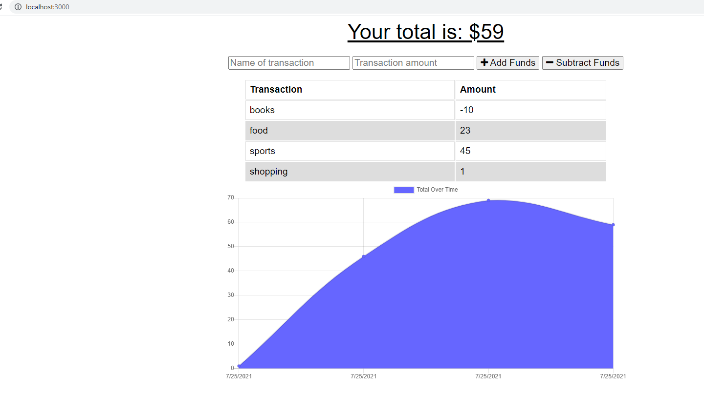

# Budget-Tracker

## Table of Contents

* [Description](#description)
* [Deployment](#deployment)
* [Built With](#built-with)
* [Contributing](#contributing)
* [Authors](#authors)

## Description

The user will be able to add expenses and deposits to their budget with or without a connection. A user will also be able to download the app since it is a progressive web app. When entering transactions offline, they should populate the total when brought back online. Offline functionality: 

Enter deposits offline
Enter expenses offline. 

When brought back online, the offline entries should be added to tracker.

## Usage

Clone the repo and run `npm i` then  `npm run start` to host the application locally.

## Built With

* HTML
* CSS
* JavaScript
* Node.js
* Express
* MongoDB
* Mongoose

## Screenshot of app

## Acceptance Criteria
GIVEN a user is on Budget App without an internet connection
WHEN the user inputs a withdrawal or deposit
THEN that will be shown on the page, and added to their transaction history when their connection is back online.

## Business Context

Giving users a fast and easy way to track their money is important, but allowing them to access that information anytime is even more important. Having offline functionality is paramount to our applications success.